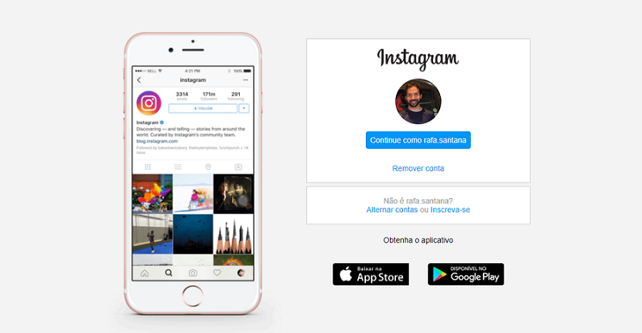

<h1>Página de login do Instagram</h1>

Este projeto foi uma das atividades encontradas no <strong>Bootcamp HTML Web Developer</strong>, da <strong>Digital Innovation One</strong>.

O objetivo foi recriar a página de login do Instagram conforme as orientações da instrutora Gabriela Pinheiro.

Fiz quatro alterações em relação ao modelo original.

<ol>
  <li>Usei variáveis para trabalhar com as cores.</li>
  <li>Diminui o <code>height</code> da imagem do telefone de <code>48rem</code> para <code>45rem</code>, com o objetivo de tirar a barra de rolagem da página.</li>
  <li>Acrescentei um media querie com <code>max-width</code> de 360px, pensando nas telas menores, como o meu velho Samsung Galaxy S3 mini &#x1F607.</li>
  <li>Por último, incluí as imagens apple-button e googleplay-button com texto em português.</li>
</ol> 

<h2 style="margin-bottom: 16px;">O projeto concluído ficou assim:</h2>

